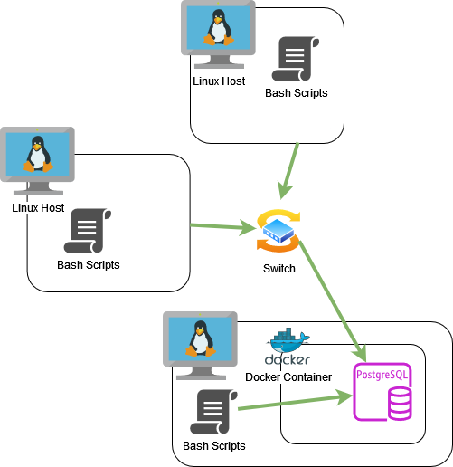

# Linux Cluster Monitoring Agent
This project is under development. Since this project follows the GitFlow, the final work will be merged to the main branch after Team Code Team.

# Introduction
This project is designed to collect and monitor hardware data and machine resource data on designated host machines,
leveraging a combination of Bash scripting, Docker, crontab, and PostgreSQL. Using Bash, our host_info bash script
gathers crucial hardware information while host_usage collects host resource usage data to constantly check how the
system is performing. Docker is employed for containerization, ensuring portability and scalability of the application 
across various environments. PostgreSQL is hosted within the Docker container. The continuous monitoring process through
crontab checks usage statistics on host machines, providing real-time insights into resource utilization. It allows 
users in charge of the cluster of linux machines to easily access usage statistics from the PSQL database and utilize
SQL queries to collect important statistics such as average amount of idle cpu time across various machines over
select time periods.

# Quick Start
- Start a psql instance using psql_docker.sh
  ```shell
  ./psql_docker.sh start|stop|create [db_username][db_password]
   ```
- Create tables using ddl.sql
  ```shell
  psql -h localhost -U postgres -d host_agent -f sql/ddl.sql
  ```
- Insert hardware specs data into the DB using host_info.sh
  - (Note: Assumes default user and password change accordingly)
    ```shell
    ./host_info.sh localhost 5432 host_agent "postgres" "password"
    ```
- Insert hardware usage data into the DB using host_usage.sh
  - (Note: Assumes default user and password change accordingly)
    ```shell
    ./host_usage.sh localhost 5432 host_agent "postgres" "password"
    ```
- Crontab setup
  - Adjust after typing crontab -e in the command line (Note: /tmp/host_usage.log is an optional output file, 
  adjust accordingly)
    ```shell
     * * * * * bash {PATH_TO_SCRIPT}/host_usage.sh localhost 5432 host_agent postgres password &> /tmp/host_usage.log
    ```

# Implemenation
A docker container was first created to include our Postgres database and ensure we could connect to the db on our
machine. I created a script to automatically create, start, and or stop this docker container after testing manually 
through the command line. Next I found the commands to retrieve hardware information and linux resource usage data. 
After experimenting via various  regular expressions I implemented a bash script to pull all necessary information. 
Next I provisioned the db, defining the two tables, one for hardware info and the other for resource usage putting 
this into a ddl script that creates the tables. Lastly, I made sure these scripts ran and connected to our docker 
containers psql db and created a cronjob so that the resource statistics could be updated every minute.

## Architecture


## Scripts
- psql_docker.sh
  - Allows us to create and or start and stop the docker container on the given instance.
  ```shell
  ./psql_docker.sh start|stop|create [db_username][db_password]
   ```
- host_info.sh
  - Retrieve info on the host machine such as number of CPU(s), CPU architecture, etc. and forward this into our 
  Postgres db.
    (Note: Assumes default db_username (postgres) and password (password), change accordingly)
  ```shell
  ./host_info.sh localhost 5432 host_agent "postgres" "password"
  ```
- host_usage.sh
  - Retrieve info on the host machine such as amount of free memory, disk space available, etc. and updates this into
  our postgres db.
    (Note: Assumes default db_username (postgres) and password (password), change accordingly)
  ```shell
  ./host_usage.sh localhost 5432 host_agent "postgres" "password"
  ```
- crontab 
  - Runs host_usage.sh every minute to check the host agents usage statistics.

## Database Modeling
- `host_info`

| Columns          | Type      |
|------------------|-----------|
| id               | SERIAL    | 
| hostname         | VARCHAR   | 
| cpu_number       | INT2      |
| cpu_architecture | VARCHAR   | 
| cpu_model        | VARCHAR   | 
| cpu_mhz          | FLOAT8    | 
| l2_cache         | INT4      | 
| "timestamp"      | TIMESTAMP |
| total_mem        | INT4      | 

- `host_usage`

| Columns        | Type      |
|----------------|-----------|
| "timestamp"    | TIMESTAMP |
| host_id        | SERIAL    | 
| memory_free    | INT4      | 
| cpu_idle       | INT2      |
| cpu_kernel     | INT2      | 
| disk_io        | INT4      | 
| disk_available | INT4      | 

# Test
To test the bash scripts DDL I ran the script on a new docker container with the psql db to ensure the tables would be
created. I also tested on a database with the already existing schema to ensure running the script does not ruin
any of the existing schema. INSERT statements were also tested via running the bash scripts and the command line while 
later connecting and querying the db to ensure sufficient results.

# Deployment
Publicly this application and scripts has been published to GitHub for future reference. Locally crontab is continually
running the bash script on the machine to update our usage statistics on our local psql database in our host machine.

# Improvements
- I would like to add some SQL queries, so they can be run at the end of the week or certain times to summarize usage
statistics throughout the week. These will then be pushed to the database as well.
- I would like to somehow incorporate models or graphs built from the SQL queries to better display the usage 
statistics.
- I would like to be able to handle hardware updates.